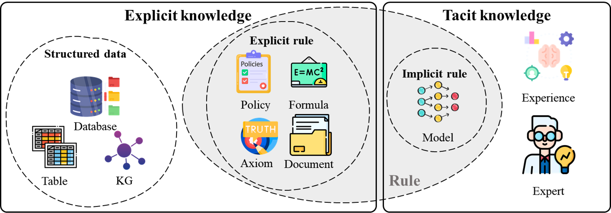
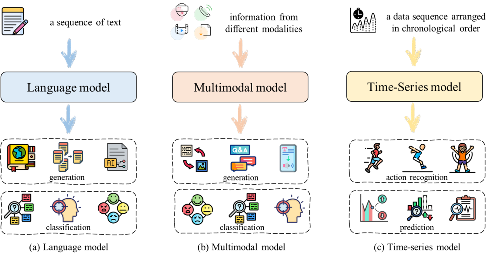
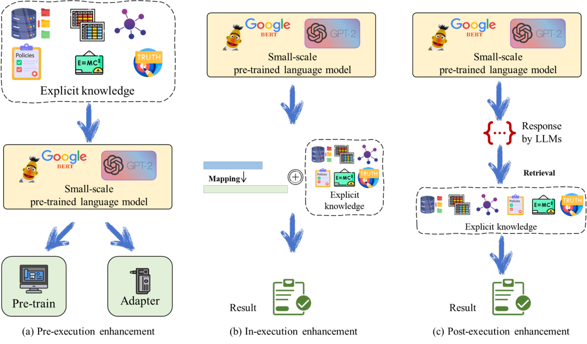
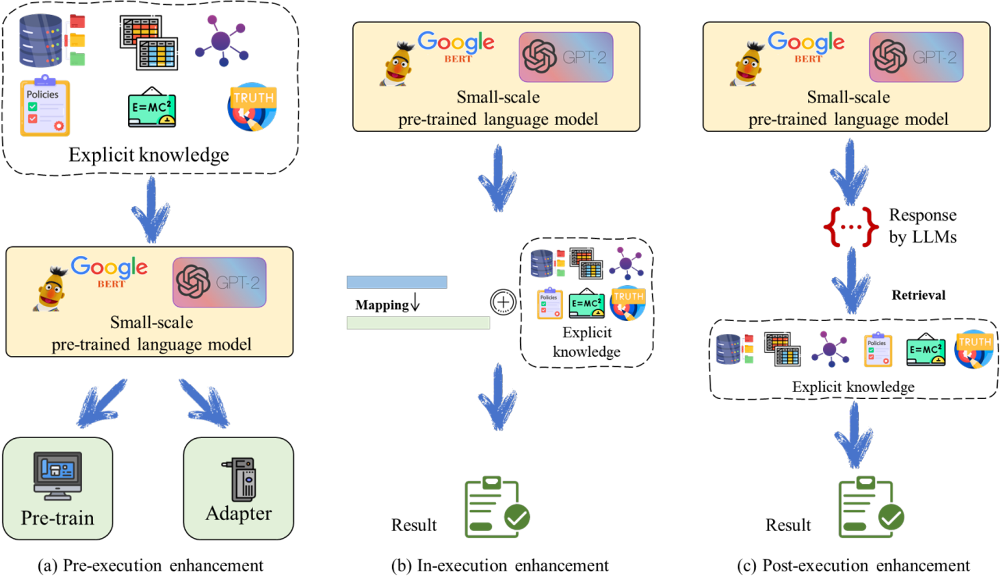
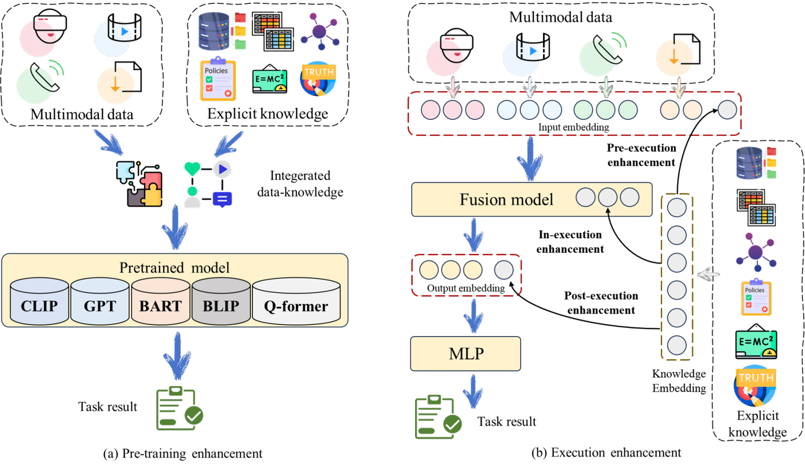
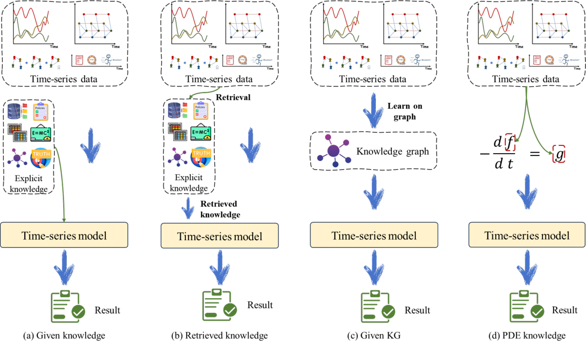
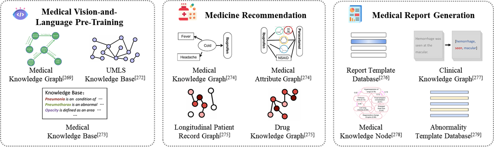

# Knowledge-enhanced AI models for domain-specific application: a survey

[](https://link.springer.com/article/10.1007/s11432-025-4635-0)
[](https://www.sciengine.com/SCIS/)

This repository serves as the official resource list for the survey paper **"Knowledge-enhanced AI models for domain-specific application: a survey"**, published in *Science China Information Sciences*.

We provide a systematic synthesis review of the techniques employed in **explicit knowledge-enhanced models**, encompassing **Language Models**, **Multimodal Models**, and **Time-series Models**.

## 📖 Abstract

With the rapid development of artificial intelligence (AI), deep learning models have played an irreplaceable role across various domains. However, in practical applications, these models often suffer from limitations such as poor transferability, limited explainability, susceptibility to overfitting, and high update costs. Recently, knowledge-enhanced models have emerged as a promising solution.

**This survey focuses on explicit knowledge that is easy to represent and retrieve.** We propose a taxonomy based on three phases of model execution:

1.  **Pre-execution** (Input enhancement, Pre-training, Prompting)
2.  **In-execution** (Retrieval, Interaction, Reasoning)
3.  **Post-execution** (Verification, Correction, Re-ranking)

## 🗂️ Taxonomy & Framework

### 1、Classification of Explicit Knowledge

We divide explicit knowledge into two major forms based on external representation: **Structured Data** (including Knowledge Graphs, Tables, and Databases) and **Explicit Rules** (including Policies, Formulas, and Axioms). 



### 2. Classification of Models

According to the different types of input data, we classify existing models into three primary categories:

- **Language Models:** Designed to process text-based input (e.g., sentences, paragraphs). 
- **Multimodal Models:** Capable of processing and aligning information from heterogeneous modalities (e.g., text, image, audio, video).  
- **Time-series Models:** Specialized in handling data sequences arranged in chronological order (e.g., sensor data, stock prices).



---

## 📝 Paper List

### 1. Language Models

#### 1.1 Small-scale PLMs (e.g., BERT, RoBERTa)



**Pre-execution Enhancement (Pre-training & Fine-tuning)**

-   [**ERNIE: Enhanced Language Representation with Informative Entities**](https://arxiv.org/abs/1905.07129)  
    Zhang Z, Han X, Liu Z, et al. ACL, 2019
-   [**KEPLER: A Unified Model for Knowledge Embedding and Pre-trained Language Representation**](https://arxiv.org/abs/1911.06136)  
    Wang X, Gao T, Zhu Z, et al. TACL, 2021
-   [**SenseBERT: Driving Some Sense into BERT**](https://arxiv.org/abs/1908.05646)  
    Levine Y, Lenz B, Dagan O, et al. ACL, 2020
-   [**JAKET: Joint Pre-training of Knowledge Graph and Language Understanding**](https://arxiv.org/abs/2010.00796)  
    Yu D, Zhu C, Yang Y, et al. AAAI, 2022
-   [**LUKE: Deep Contextualized Entity Representations with Entity-aware Self-attention**](https://arxiv.org/abs/2010.01057)  
    Yamada I, Asai A, Shindo H, et al. EMNLP, 2020
-   [**ERNIE 3.0: Large-scale Knowledge Enhanced Pre-training for Language Understanding and Generation**](https://arxiv.org/abs/2107.02137)  
    Sun Y, Wang S, Feng S, et al. ArXiv, 2021
-   [**DKPLM: Decomposable Knowledge-Enhanced Pre-trained Language Model**](https://arxiv.org/abs/2112.01047)  
    Zhang T, Wang C, Hu N, et al. AAAI, 2022
-   [**CoLAKE: Contextualized Language and Knowledge Embedding**](https://arxiv.org/abs/2010.00309)  
    Sun T, Shao Y, Qiu X, et al. COLING, 2020
-   [**Dict-BERT: Enhancing Language Model Pre-training with Dictionary**](https://arxiv.org/abs/2110.06490)  
    Yu W, Zhu C, Fang Y, et al. Findings of ACL, 2022
-   [**TP-BERTa: Making Pre-trained Language Models Great on Tabular Prediction**](https://arxiv.org/abs/2403.01841)  
    Yan J, Zheng B, Xu H, et al. ICLR, 2024
-   [**KG-BART: Knowledge Graph-Augmented BART for Generative Commonsense Reasoning**](https://arxiv.org/abs/2009.12677)  
    Liu Y, Wan Y, He L, et al. AAAI, 2021
-   [**UNIKGQA: Unified Retrieval and Reasoning for Solving Multi-hop Question Answering**](https://arxiv.org/abs/2212.00959)  
    Jiang J, Zhou K, Zhao W X, et al. ACL, 2023
-   [**K-BERT: Enabling Language Representation with Knowledge Graph**](https://arxiv.org/abs/1909.07606)  
    Liu W, Zhou P, Zhao Z, et al. AAAI, 2020
-   [**ReasoningLM: Enabling Structural Subgraph Reasoning in Pre-trained Language Models**](https://arxiv.org/abs/2401.00158)  
    Jiang J, Zhou K, Zhao W X, et al. EMNLP, 2023
-   [**KnowLog: Knowledge Enhanced Pre-trained Language Model for Log Understanding**](https://dl.acm.org/doi/10.1145/3597503.3623304)  
    Ma L, Yang W, Xu B, et al. ICSE, 2024
-   [**KPatch: Knowledge Patch to Pre-trained Language Model for Zero-shot Stance Detection**](https://aclanthology.org/2024.lrec-main.872/)  
    Lin S, Chen W, Gao Y, et al. LREC-COLING, 2024
-   [**K-Adapter: Infusing Knowledge into Pre-Trained Models with Adapters**](https://arxiv.org/abs/2002.01808)  
    Wang R, Tang D, Duan N, et al. ACL (Findings), 2021
-   [**ADELE: Sustainable Modular Debiasing of Language Models**](https://arxiv.org/abs/2109.03646)  
    Lauscher A, Lueken T, Glavaš G. ArXiv, 2021
-   [**PlugD: Plug-and-Play Document Modules for Pre-trained Models**](https://arxiv.org/abs/2305.17660)  
    Xiao C, Zhang Z, Han X, et al. ACL, 2023

**In-execution Enhancement**

-   [**E-BERT: Efficient-Yet-Effective Entity Embeddings for BERT**](https://arxiv.org/abs/1911.03681)  
    Poerner N, Waltinger U, Schütze H. Findings of EMNLP, 2020
-   [**MapTuning: Plug-and-Play Knowledge Injection for Pre-trained Language Models**](https://arxiv.org/abs/2305.17691)  
    Zhang Z, Zeng Z, Lin Y, et al. ArXiv, 2023
-   [**QA-GNN: Reasoning with Language Models and Knowledge Graphs for Question Answering**](https://arxiv.org/abs/2104.06378)  
    Yasunaga M, Ren H, Bosselut A, et al. NAACL, 2021
-   [**BAYESPROMPT: Prompting Large-Scale Pre-Trained Language Models on Few-Shot Inference via Debiased Domain Abstraction**](https://arxiv.org/abs/2401.14166)  
    Li J, Song F, Jin Y, et al. ICLR, 2024
-   [**KG-prompt: Interpretable Knowledge Graph Prompt for Pre-trained Language Models**](https://www.sciencedirect.com/science/article/abs/pii/S0950705125001650)  
    Chen L, Liu J, Duan Y, et al. Knowledge-Based Syst., 2025

**Post-execution Enhancement**

-   [**KG-BART**](https://arxiv.org/abs/2009.12677) (Used for explanation generation)  
    Liu Y, Wan Y, He L, et al. AAAI, 2021
-   [**LogiQA: Generating Hierarchical Explanations on Text Classification via Feature Interaction Detection**](https://arxiv.org/abs/2004.02015)  
    Chen H, Zheng G, Ji Y. ACL, 2020

| Method             | Advantages                                                   | Limitations                                                  |
| ------------------ | ------------------------------------------------------------ | ------------------------------------------------------------ |
| **Pre-execution**  | • Stable knowledge enhancement<br>• Improves base representations<br>• Consistent downstream gains | • Static knowledge (no updates)<br>• Retraining needed for new domains<br>• High computational cost |
| **In-execution**   | • Real-time knowledge dynamic updates<br>• Context-aware adaptation<br>• No model retraining | • Complex architecture design<br>• Efficiency-performance tradeoff<br>• Limited by PLM capacity |
| **Post-execution** | • Flexible deployment<br>• Explainable corrections<br>• Direct output modification | • Output consistency issues<br>• Algorithm-dependent results<br>• No standard evaluation |

#### 1.2 Large Language Models (LLMs)



#### **Pre-execution Enhancement (Prompt Engineering)**

-   [**KnowGPT: Knowledge Graph Based Prompting for Large Language Models**](https://arxiv.org/abs/2312.06185)  
    Zhang Q, Dong J, Chen H, et al. NeurIPS, 2024
-   [**RD-P: A Trustworthy Retrieval-Augmented Prompter with Knowledge Graphs for LLMs**](https://dl.acm.org/doi/10.1145/3627673.3679659)  
    Huang Y, Zeng G. CIKM, 2024
-   [**KG-CoT: Chain-of-Thought Prompting of Large Language Models over Knowledge Graphs**](https://www.ijcai.org/proceedings/2024/0734.pdf)  
    Zhao R, Zhao F, Wang L, et al. IJCAI, 2024

**In-execution Enhancement (Retrieval & Reasoning)**

-   [**SimGRAG: Leveraging Similar Subgraphs for Knowledge Graphs Driven Retrieval-Augmented Generation**](https://arxiv.org/abs/2412.15272)  
    Cai Y, Guo Z, Pei Y, et al. ArXiv, 2024
-   [**KG-Rank: Enhancing Large Language Models for Medical QA with Knowledge Graphs and Ranking Techniques**](https://aclanthology.org/2024.bionlp-1.13/)  
    Yang R, Liu H, Marrese-Taylor E, et al. BioNLP, 2024
-   [**RoG: Reasoning on Graphs: Faithful and Interpretable Large Language Model Reasoning**](https://arxiv.org/abs/2310.01061)  
    Luo L, Li Y-F, Haffari G, et al. ICLR, 2024
-   [**ToG: Think-on-Graph: Deep and Responsible Reasoning of Large Language Model on Knowledge Graph**](https://arxiv.org/abs/2307.07697)  
    Sun J, Xu C, Tang L, et al. ICLR, 2024
-   [**PoG: Paths-over-Graph: Knowledge Graph Enpowered Large Language Model Reasoning**](https://arxiv.org/abs/2410.14211)  
    Tan X, Wang X, Liu Q, et al. WWW, 2025
-   [**R³: Right for Right Reasons: Large Language Models for Verifiable Commonsense Knowledge Graph Question Answering**](https://aclanthology.org/2024.emnlp-main.378/)  
    Toroghi A, Guo W, Pour M M A, et al. EMNLP, 2024
-   [**PoG: Plan-on-Graph: Self-Correcting Adaptive Planning of Large Language Model on Knowledge Graphs**](https://arxiv.org/abs/2410.23875)  
    Chen L, Tong P, Jin Z, et al. NeurIPS, 2024
-   [**GoG: Generate-on-Graph: Treat LLM as both Agent and KG for Incomplete KGQA**](https://arxiv.org/abs/2404.14741)  
    Xu Y, He S, Chen J, et al. EMNLP, 2024
-   [**Triad: A Framework Leveraging a Multi-Role LLM-based Agent to Solve Knowledge Base Question Answering**](https://aclanthology.org/2024.emnlp-main.101/)  
    Zong C, Yan Y, Lu W, et al. EMNLP, 2024
-   [**KG-Agent: An Efficient Autonomous Agent Framework for Complex Reasoning over Knowledge Graph**](https://arxiv.org/abs/2402.11163)  
    Jiang J, Zhou K, Zhao W X, et al. ArXiv, 2024
-   [**Rule-KBQA: Rule-Guided Reasoning for Complex Knowledge Base Question Answering**](https://aclanthology.org/2025.coling-main.562/)  
    Zhang Z, Wen L, Zhao W. COLING, 2025

**Post-execution Enhancement**

-   [**KB-BINDER: Few-shot In-context Learning for Knowledge Base Question Answering**](https://arxiv.org/abs/2305.01750)  
    Li T, Ma X, Zhuang A, et al. ACL, 2023
-   [**ChatKBQA: A Generate-then-Retrieve Framework for Knowledge Base Question Answering**](https://arxiv.org/abs/2310.08975)  
    Luo H, E H, Tang Z, et al. ACL (Findings), 2024

| Method             | Advantages                                                   | Limitations                                                  |
| ------------------ | ------------------------------------------------------------ | ------------------------------------------------------------ |
| **Pre-execution**  | • Simple flexible deployment<br>• Strong versatility and scalability<br>• Low implementation cost | • High prompt sensitivity<br>• Fixed reasoning paths<br>• Low knowledge utilization efficiency |
| **In-execution**   | • Dynamic interactive knowledge access<br>• Adaptive reasoning path adjustment<br>• Real-time feedback mechanisms | • High system complexity<br>• Large computational resource<br>• Instruction following dependency |
| **Post-execution** | • Reliable verification and correction<br>• Decoupled from reasoning process<br>• Easy framework integration | • Dependency verification knowledge<br>• Lacks generative flexibility<br>• Increases processing time overhead |

---

### 2. Multimodal Models



**Pre-execution Enhancement**

-   [**Knowledge-CLIP: Contrastive language-image pre-training with knowledge graphs**](https://arxiv.org/abs/2210.08901)  
    Pan X, Ye T, Han D, et al. NeurIPS, 2022
-   [**REAVL: Retrieval-Based Knowledge Augmented Vision Language Pre-Training**](https://dl.acm.org/doi/abs/10.1145/3581783.3613848)  
    Rao J, Shan Z, Liu L, et al. ACM MM, 2023
-   [**RA-BLIP: Multimodal Adaptive Retrieval-Augmented Bootstrapping Language-Image Pre-training**](https://arxiv.org/abs/2410.14154)  
    Ding M, Ma Y, Qin P, et al. ArXiv, 2024
-   [**UKnow: A Unified Knowledge Protocol with Multimodal Knowledge Graph Datasets**](https://arxiv.org/abs/2302.06891)  
    Gong B, Tan S, Feng Y, et al. NeurIPS, 2024
-   [**KTIR: Knowledge-Aware Text-Image Retrieval for Remote Sensing Images**](https://ieeexplore.ieee.org/document/10736645)  
    Mi L, Dai X, Castillo-Navarro J, et al. IEEE TGRS, 2024
-   [**KMRec: Knowledge-Aware User Multi-Interest Modeling Method for News Recommendation**](https://link.springer.com/article/10.1007/s10115-024-02290-5)  
    Zuo Z, Lu J, Tan L, et al. Knowl Inf Syst, 2025
-   [**MR-MKG: Multimodal Reasoning with Multimodal Knowledge Graph**](https://arxiv.org/abs/2406.02030)  
    Lee J, Wang Y, Li J, et al. ACL, 2024
-   [**KAM-CoT: Knowledge Augmented Multimodal Chain-of-Thoughts Reasoning**](https://arxiv.org/abs/2401.12863)  
    Mondal D, Modi S, Panda S, et al. AAAI, 2024
-   [**KECPM: Few-Shot Joint Multimodal Entity-Relation Extraction via Knowledge-Enhanced Cross-Modal Prompt Model**](https://arxiv.org/abs/2410.14225)  
    Yuan L, Cai Y, Huang J. ACM MM, 2024

**In-execution Enhancement**

-   [**IKIR: Inferential Knowledge-Enhanced Integrated Reasoning for Video Question Answering**](https://ojs.aaai.org/index.php/AAAI/article/view/26570)  
    Mao J, Jiang W, Liu H. AAAI, 2023
-   [**KVQAE: Explicit Knowledge Integration for Knowledge-Aware Visual Question Answering about Named Entities**](https://dl.acm.org/doi/10.1145/3591106.3592227)  
    Adjali O, Grimal P, Ferret O, et al. ICMR, 2023
-   [**MMV: Multi-Modal Validation and Domain Interaction Learning for Knowledge-Based Visual Question Answering**](https://ieeexplore.ieee.org/document/10496907)  
    Xu N, Gao Y, Liu A A, et al. IEEE TKDE, 2024
-   [**KAMV: A Knowledge Augmented and Multimodal-Based Framework for Video Summarization**](https://dl.acm.org/doi/abs/10.1145/3503161.3548089)  
    Xie J, Chen X, P S, et al. ACM MM, 2022
-   [**KAMN: Video Summarization via Knowledge-Aware Multimodal Deep Networks**](https://doi.org/10.1016/j.knosys.2024.111670)  
    Xie J, Chen X, Zhao S, et al. Knowledge-Based Syst, 2024
-   [**KEMoS: A Knowledge-Enhanced Multi-modal Summarizing Framework**](https://doi.org/10.1016/j.neunet.2024.106417)  
    Qi P, Sun Y, Yao M, et al. Neural Networks, 2024
-   [**LION: Empowering Multimodal Large Language Model with Dual-Level Visual Knowledge**](https://arxiv.org/abs/2311.11860)  
    Chen G, Shen L, Shao R, et al. CVPR, 2024
-   [**Knowledge Enhanced Vision and Language Model for Multi-modal Fake News Detection**](https://ieeexplore.ieee.org/document/10505027)  
    Gao X, Wang X, Chen Z, et al. IEEE TMM, 2024

**Post-execution Enhancement**

-   [**SKEAFN: Sentiment Knowledge Enhanced Attention Fusion Network**](https://doi.org/10.1016/j.inffus.2023.101958)  
    Zhu C, Chen M, Zhang S, et al. Inf Fusion, 2023
-   [**Zero-shot ECG Classification with Multimodal Learning and Test-time Clinical Knowledge Enhancement**](https://arxiv.org/abs/2403.06659)  
    Liu C, Wan Z, Ouyang C, et al. ArXiv, 2024
-   [**ProSurv: Prototype-guided Cross-modal Knowledge Enhancement for Adaptive Survival Prediction**](https://arxiv.org/abs/2503.10726)  
    Liu F, Cai L, Wang Z, et al. ArXiv, 2025

| Method             | Advantages                                                   | Limitations                                                  |
| ------------------ | ------------------------------------------------------------ | ------------------------------------------------------------ |
| **Pre-execution**  | • Improves early semantic alignment<br>• Enables domain-aware pretraining<br>• Enhances generalization | • Static knowledge; lacks adaptability<br>• Limited response to context shifts<br>• Fixed representation space |
| **In-execution**   | • Enables dynamic knowledge access<br>• Enhances context-aware reasoning<br>• Facilitates fine-grained integration | • High runtime complexity<br>• Sensitive to retrieval quality |
| **Post-execution** | • Supports output refinement<br>• Decoupled from model design<br>• Improves factual consistency | • Limited influence on core reasoning<br>• Relies on auxiliary input<br>• May increase inference latency |

---

### 3. Time-series Models



**Pre-execution Enhancement**

-   [**Prompt to transfer: sim-to-real transfer for traffic signal control with prompt learning **](https://arxiv.org/abs/2308.14284)  
    Da L, Gao M, Mei H, et al. AAAI, 2024
-   [**FNSPID: A Comprehensive Financial News Dataset in Time Series**](https://arxiv.org/abs/2402.06698)  
    Dong Z, Fan X, Peng Z. KDD, 2024
-   [**K-Link: Knowledge-Link Graph from LLMs for Enhanced Representation Learning**](https://arxiv.org/html/2403.03645)  
    Wang Y, Jin R, Wu M, et al. ArXiv, 2024
-   [**AutoTimes: Autoregressive Time Series Forecasters via Large Language Models**](https://arxiv.org/abs/2402.02370)  
    Liu Y, Qin G, Huang X, et al. NeurIPS, 2024
-   [**UniTime: A Language-Empowered Unified Model for Cross-Domain Time Series Forecasting**](https://arxiv.org/abs/2310.09751)  
    Liu X, Hu J, Li Y, et al. WWW, 2024
-   [**GLAFF: Rethinking the Power of Timestamps for Robust Time Series Forecasting**](https://arxiv.org/abs/2409.18696)  
    Wang C, Qi Q, Wang J, et al. NeurIPS, 2024
-   [**TableTime: Reformulating Time Series Classification as Zero-Shot Table Understanding**](https://dl.acm.org/doi/abs/10.1145/3746252.3761056)  
    Wang J, Cheng M, Mao Q, et al. CIKM, 2025
-   [**AlphaFin: Benchmarking Financial Analysis with Retrieval-Augmented Stock-Chain Framework**](https://arxiv.org/abs/2403.12582)  
    Li X, Li Z, Shi C, et al. ArXiv, 2024
-   [**TimeRAF: Retrieval-Augmented Foundation Model for Zero-Shot Time Series Forecasting**](https://arxiv.org/abs/2412.20810)  
    Zhang H, Xu C, Zhang Y F, et al. ArXiv, 2024
-   [**RATD: Retrieval-Augmented Diffusion Models for Time Series Forecasting**](https://arxiv.org/abs/2410.18712)  
    Liu J, Yang L, Li H, et al. NeurIPS, 2024
-   [**DGTFAD: Incorporating Prior Knowledge for Domain Generalization Traffic Flow Anomaly Detection**](https://link.springer.com/article/10.1007/s00521-024-10632-1)  
    Chen B, Fang M, Wei H J. Neural Comput Applic, 2025

**In-execution Enhancement**

-   [**PKET-GCN: Prior Knowledge Enhanced Time-Varying Graph Convolution Network**](https://www.sciencedirect.com/science/article/abs/pii/S0020025523004188)  
    Bao Y, Liu J, Shen Q, et al. Inf Sci, 2023
-   [**The Merit of River Network Topology for Neural Flood Forecasting**](https://arxiv.org/abs/2405.19836)  
    Kirschstein N, Sun Y. ArXiv, 2024
-   [**MAGNN: Financial Time Series Forecasting with Multi-Modality Graph Neural Network**](https://www.sciencedirect.com/science/article/abs/pii/S003132032100399X)  
    Cheng D, Yang F, Xiang S, et al. Pattern Recognition, 2022
-   [**ClimODE: Climate and Weather Forecasting with Physics-Informed Neural ODEs**](https://arxiv.org/abs/2404.10024)  
    Verma Y, Heinonen M, Garg V. ICLR, 2024
-   [**Air-DualODE: Air Quality Prediction with Physics-Informed Dual Neural ODEs**](https://arxiv.org/abs/2410.19892)  
    Tian J, Liang Y, Xu R, et al. ArXiv, 2024
-   [**STDDE: Unveiling Delay Effects in Traffic Forecasting: A Perspective from Spatial-Temporal Delay Differential Equations**](https://arxiv.org/abs/2402.01231)  
    Long Q, Fang Z, Fang C, et al. WWW, 2024
-   [**KENN: Addressing Data Dependency in Neural Networks**](https://link.springer.com/article/10.1007/s10994-024-06578-8)  
    Chattha M A, Malik M I, Dengel A, et al. Mach Learn, 2025

**Post-execution Enhancement**

-   [**ChatTime: A Unified Multimodal Time Series Foundation Model**](https://arxiv.org/abs/2412.11376)  
    Wang C, Qi Q, Wang J, et al. ArXiv, 2024
-   [**CAP: Causal and Interpretable Rules for Time Series Analysis**](https://dl.acm.org/doi/10.1145/3447548.3467161)  
    Dhaou A, Bertoncello A, Gourvénec S, et al. KDD, 2021
-   [**From News to Forecast: Integrating Event Analysis in LLM-Based Time Series Forecasting with Reflection**](https://arxiv.org/abs/2409.17515)  
    Wang X, Feng M, Qiu J, et al. NeurIPS, 2024

| Method             | Advantages                                                   | Limitations                                                  |
| ------------------ | ------------------------------------------------------------ | ------------------------------------------------------------ |
| **Pre-execution**  | • Multimodal capabilities<br>• Portability and flexibility<br>• Multi-domain versatility | • High cost of LLMs<br>• Distribution shift problem of RAGs<br>• Highly empirical rules |
| **In-execution**   | • Priori variate-wise dependence<br>• Physical meaningfulness<br>• Interpretability and explainability | • Versatility limitation across domains<br>• Complex model design<br>• Sensitivity to prior knowledge |
| **Post-execution** | • Robustness of knowledge<br>• Trustable output<br>• Retrieval process optimization | • Less exploration<br>• Extra computational cost<br>• Reliance to knowledge quality |

---

### 4. Domain-specific Applications

#### ⚛️ AI4Science


**Physics**

-   [**PI-DKL: Physics Informed Deep Kernel Learning**](https://proceedings.mlr.press/v151/wang22a.html)  
    Wang Z, Xing W, Kirby R, et al. AISTATS, 2022
-   [**Learning to Dehaze with Polarization**](https://proceedings.neurips.cc/paper/2021/hash/5fd0b37cd7dbbb00f97ba6ce92bf5add-Abstract.html)  
    Zhou C, Teng M, Han Y, et al. NeurIPS, 2021
-   [**Using a Physics-Informed Neural Network and Fault Zone Acoustic Monitoring to Predict Lab Earthquakes**](https://www.nature.com/articles/s41467-023-39377-6)  
    Borate P, Rivière J, Marone C, et al. Nat Commun, 2023

**Chemistry**

-   [**KANO: Knowledge Graph-Enhanced Molecular Contrastive Learning with Functional Prompt**](https://www.nature.com/articles/s42256-023-00654-0)  
    Fang Y, Zhang Q, Zhang N, et al. Nat Mach Intell, 2023
-   [**MV-Mol: Learning Multi-View Molecular Representations with Structured and Unstructured Knowledge**](https://arxiv.org/abs/2406.09841)  
    Luo Y, Yang K, Hong M, et al. KDD, 2024
-   [**Reaction Performance Prediction with an Extrapolative and Interpretable Graph Model**](https://www.nature.com/articles/s41467-023-39283-x)  
    Li S W, Xu L C, Zhang C, et al. Nat Commun, 2023

**Biology**

-   [**GEARS: Predicting Transcriptional Outcomes of Novel Multigene Perturbations**](https://www.nature.com/articles/s41587-023-01905-6)  
    Roohani Y, Huang K, Leskovec J. Nat Biotechnol, 2024
-   [**KG-MTL: Knowledge Graph Enhanced Multi-Task Learning for Molecular Interaction**](https://ieeexplore.ieee.org/abstract/document/9815157)  
    Ma T, Lin X, Song B, et al. IEEE TKDE, 2022
-   [**KeAP: Protein Representation Learning via Knowledge Enhanced Primary Structure Modeling**](https://arxiv.org/abs/2301.13154)  
    Zhou H Y, Fu Y, Zhang Z, et al. ICLR, 2023

---

#### 💊 AI4Medicine




**Medical Vision-and-Language Pre-training**

-   [**KAD: Knowledge-enhanced visual-language pre-training on chest radiology images**](https://www.nature.com/articles/s41467-023-40260-7)  
    Zhang X, Wu C, Zhang Y, et al. Nat Commun, 2023
-   [**Align, Reason and Learn: Enhancing Medical Vision-and-Language Pre-training with Knowledge**](https://arxiv.org/abs/2209.07118)  
    Chen Z, Li G, Wan X. ACM MM, 2022
-   [**MedKLIP: Medical Knowledge Enhanced Language-Image Pre-Training for X-ray Diagnosis**](https://arxiv.org/abs/2301.02228)  
    Wu C, Zhang X, Zhang Y, et al. ICCV, 2023

**Medicine Recommendation**

-   [**MedRec: Knowledge-Enhanced Attributed Multi-Task Learning for Medicine Recommendation**](https://dl.acm.org/doi/10.1145/3527662)  
    Zhang Y, Wu X, Fang Q, et al. ACM TOIS, 2023
-   [**GAMENet: Graph Augmented Memory Networks for Recommending Medication Combination**](https://ojs.aaai.org/index.php/AAAI/article/view/3905)  
    Shang J, Xiao C, Ma T, et al. AAAI, 2019

**Medical Report Generation**

-   [**HRGR-Agent: Hybrid Retrieval-Generation Reinforced Agent for Medical Image Report Generation**](https://arxiv.org/abs/1805.08298)  
    Li Y, Liang X, Hu Z, et al. NeurIPS, 2018
-   [**Cross-Modal Clinical Graph Transformer for Ophthalmic Report Generation**](https://openaccess.thecvf.com/content/CVPR2022/html/Li_Cross-Modal_Clinical_Graph_Transformer_for_Ophthalmic_Report_Generation_CVPR_2022_paper.html)  
    Li M, Cai W, Verspoor K, et al. CVPR, 2022
-   [**KERP: Knowledge-Driven Encode, Retrieve, Paraphrase for Medical Image Report Generation**](https://ojs.aaai.org/index.php/AAAI/article/view/4637)  
    Li C Y, Liang X, Hu Z, et al. AAAI, 2019

---

#### 🏭 AI4Industry


**Fault Diagnosis**

-   [**CausalKGPT: Industrial Structure Causal Knowledge-Enhanced Large Language Model**](https://doi.org/10.1016/j.aei.2023.102333)  
    Zhou B, Li X, Liu T, et al. Adv Eng Inf, 2024
-   [**CausalKG-ALBERT: Leveraging on Causal Knowledge for Enhancing the Root Cause Analysis**](https://doi.org/10.1016/j.aei.2022.101799)  
    Zhou B, Li J, Li X, et al. Adv Eng Inf, 2022
-   [**A Rolling Bearing Fault Diagnosis Method Based on Multimodal Knowledge Graph**](https://ieeexplore.ieee.org/document/10621043)  
    Peng C, Sheng Y, Gui W, et al. IEEE TII, 2024

**Resource Allocation**

-   [**A novel knowledge graph-based optimization approach for resource allocation in discrete manufacturing workshops**](https://www.sciencedirect.com/science/article/abs/pii/S0736584521000454)  
    Zhou B, Bao J, Li J, et al. Robot Comput-Integrated Manuf, 2021
-   [**Knowledge Graph-Enhanced Multi-Agent Reinforcement Learning for Adaptive Scheduling**](https://link.springer.com/article/10.1007/s10845-024-02494-0)  
    Qin Z, Lu Y. J Intell Manuf, 2024

**Machining Process Optimization**

-   [**Combining Deep Learning with Knowledge Graph for Macro Process Planning**](https://doi.org/10.1016/j.compind.2022.103668)  
    Zhang Y, Zhang S, Huang R, et al. Comput Industry, 2022
-   [**An effective process design intent inference method of process data via integrating deep learning and grammar parsing**](https://www.sciencedirect.com/science/article/abs/pii/S1474034623003026)  
    Huang R, Han Z, Fei M, et al. Adv Eng Inf, 2023
-   [**Knowledge Graph with Deep Reinforcement Learning for Intelligent Generation of Machining Process Design**](https://www.tandfonline.com/doi/full/10.1080/09544828.2024.2338342)  
    Hua Y, Wang R, Wang Z, et al. J Eng Des, 2024

---

## 📚 Citation

```bibtex
@article{Li2026Knowledge,
  title={Knowledge-enhanced AI models for domain-specific application: a survey},
  author={Xiang-Yang Li and Yihan Wang and Junli Liang and Xinyu Wang and Pengfei Zhou and Qi Zhao and Yuhang Zhang and Qi Song},
  journal={Science China Information Sciences},
  volume={69},
  number={4},
  year={2026},
  doi={10.1007/s11432-025-4635-0},
  url={https://doi.org/10.1007/s11432-025-4635-0}
}
```

## 📧 Contact

If you have any questions or want to include your work in this list, please create a pull request or contact the authors.

